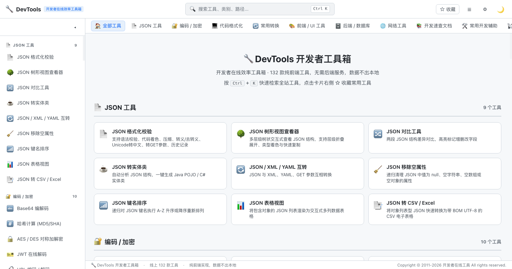
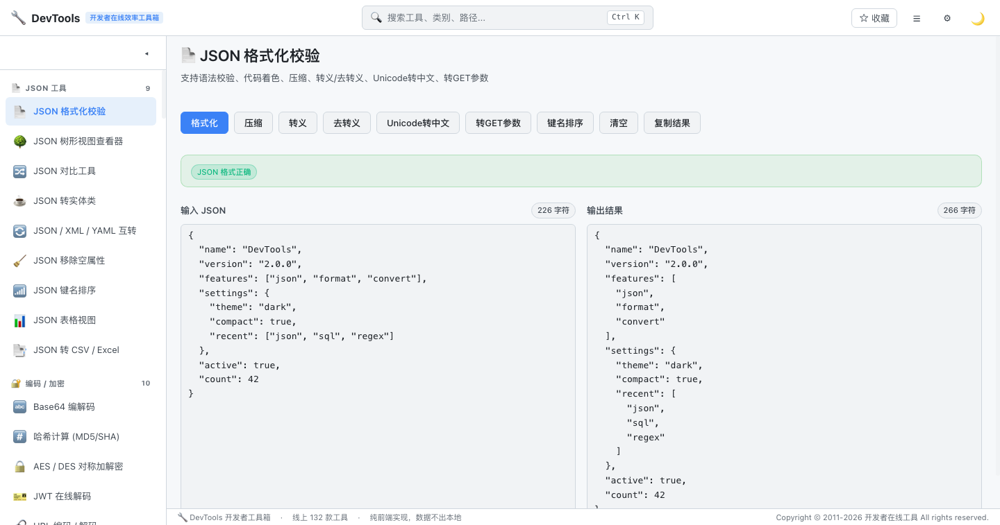

<div align="center">


# 🔧 DevTools — Developer Online Toolbox

**132+ developer tools in your browser. No sign-up, no backend, your data never leaves the page.**


</div>

A fast, front-end-only collection of **132** online tools — format, convert, encode, test and debug, all powered by Vue 3 + Vite. Inspired by [devtools.cn](https://www.devtools.cn), everything is a static SPA: open a page, paste your data, and get the result instantly.

## ✨ Highlights

- 🚀 **Zero backend** — 100% client-side. No uploads, no sign-up, data stays in your browser.
- ⚡ **On-demand loading** — every tool is a lazy-loaded route, so the app starts instantly.
- 🔍 **Instant search** — press `Ctrl + K` to search all tools and jump right in.
- ⭐ **Favorites** — pin the tools you use most; they persist locally.
- 🌓 **Smart theme** — auto light/dark by time of day, with a manual toggle.
- 📱 **Responsive** — works on desktop and mobile.

## 🧰 Tool Categories

| Category | Description | Tools |
| --- | --- | --- |
| 📄 JSON Tools | format / validate / diff / tree view / convert / sort / table / CSV-Excel | 9 |
| 🔐 Encoding / Crypto | Base64, hashes, AES/DES, RSA, JWT, URL, Unicode, Morse, passwords | 10 |
| 💻 Code Formatting | SQL / HTML / JS / CSS / XML beautify & minify | 3 |
| 🔄 Converters | timestamps, radix, case, colors, QRCode, pinyin, money & more | 25 |
| 🎨 Frontend / UI | layout helpers, image tools, units, preprocessors, web pages | 11 |
| 🗄️ Backend / Database | SQL utilities, converters & generators | 5 |
| 🌐 Network | IP, domain, HTTP/status, SSl, WebSocket & more | 8 |
| 📚 Dev References | API & syntax quick-reference docs | 7 |
| 🛠️ Assistants | text stats, dedupe, diff, mask, token count & more | 13 |
| 📡 IoT / Embedded | device & embedded tooling | 2 |
| 🔌 Open Platform & Debug | WeChat / Taobao / Alipay platform debuggers | 19 |
| 📖 Docs & Resources | curated documentation & resource links | 20 |

## 🖼️ Preview





## 🚀 Quick Start

```bash
# clone
git clone https://github.com/why19970628/devtools.git && cd devtools

# install
npm install

# dev server (http://localhost:5173)
npm run dev

# production build (dist/)
npm run build

# preview the production build
npm run preview
```

> Requires Node.js ≥ 18.

## 🧱 Tech Stack

- [Vue 3](https://vuejs.org/) — Composition API
- [Vue Router 4](https://router.vuejs.org/) — lazy-loaded routes per tool
- [Vite 5](https://vitejs.dev/) — dev server & build

## 📁 Project Structure

```text
src/
├── assets/            # global styles & theme variables
├── components/        # header, sidebar, nav, search modal, tool cards...
├── composables/       # useTheme (auto light/dark)
├── utils/             # tools registry, favorites (localStorage)
├── views/             # 130+ tool pages (one file per tool)
└── main.js
```

## 🤝 Contributing

See [CONTRIBUTING.md](CONTRIBUTING.md). PRs welcome — new tools are just new lazy-loaded views plus an entry in `src/utils/tools.js`.

## 📄 License

[MIT](LICENSE) © 2026 DevTools Contributors# devtools
